# US Hedge Fund Formation Roadmap
## Using Leveraged ETFs (TQQQ Strategy)

This document provides a comprehensive roadmap with references and sample templates for each step of forming a hedge fund.

> **Two Paths Available**:  
> 🌱 **Incubator Path**: $3K-$5K, build track record first (most emerging managers)  
> 🚀 **Full Launch**: $50K-$100K, when investors are ready

---

## Visual Roadmap


---

## Organizational Structure


---

## Phase 1: Legal Entity Formation

### 1.1 Management Company LLC (Investment Adviser)

**Purpose**: Entity that provides investment advisory services and collects fees

**References**:
- [Delaware Division of Corporations](https://corp.delaware.gov/howtoform/)
- [IRS LLC Information](https://www.irs.gov/businesses/small-businesses-self-employed/limited-liability-company-llc)
- SEC Release IA-3222: Family Office Exemption

**Sample Operating Agreement Key Provisions**:
```plaintext
OPERATING AGREEMENT OF [FUND NAME] ADVISORS, LLC

ARTICLE I - FORMATION
The Company is organized as a limited liability company under the 
Delaware Limited Liability Company Act.

ARTICLE II - PURPOSE  
The Company is formed for the purpose of providing investment 
management and advisory services to private investment funds.

ARTICLE III - MANAGEMENT FEE
The Company shall receive an annual management fee equal to 2% 
of Assets Under Management, paid quarterly in advance.

ARTICLE IV - PERFORMANCE ALLOCATION
The Company shall receive a performance allocation equal to 20% 
of net profits above a high-water mark.
```

---

### 1.2 General Partner LLC

**Purpose**: Controls the Fund LP, has unlimited liability

**References**:
- [Delaware LP Formation Guide](https://corp.delaware.gov/paycertlp/)

**Sample GP Agreement Provisions**:
```plaintext
The General Partner shall have full, exclusive, and complete 
discretion to manage and control the business and affairs of 
the Partnership, including but not limited to:

(a) Making all investment decisions
(b) Executing trades in leveraged ETFs including TQQQ
(c) Admitting and removing Limited Partners
(d) Determining distributions
(e) Hiring service providers
```

---

### 1.3 Fund LP (Limited Partnership)

**Purpose**: Main fund vehicle, holds investor capital and investments

**Key Documents**:
- Certificate of Limited Partnership (filed with state)
- Limited Partnership Agreement (LPA)

---

## Phase 2: Regulatory Requirements

### 2.1 Registration Determination

| AUM Level | Requirement | Filing |
|-----------|-------------|--------|
| < $25M | State RIA only | State Form ADV |
| $25M - $100M | State RIA (can opt for SEC) | State Form ADV |
| $100M - $150M | SEC or State | Form ADV |
| > $150M | SEC RIA required | Form ADV (SEC) |
| Any (Private Fund) | Exempt Reporting Adviser option | Form ADV (partial) |

**References**:
- [SEC Investment Adviser Registration](https://www.sec.gov/divisions/investment/iaregulation/memoia.htm)
- [IARD System](https://www.iard.com/)
- Investment Advisers Act of 1940, Section 203

---

### 2.2 Form D (Regulation D)

**When to File**: Within 15 days of first sale of securities

**Exemption Options**:

| Rule | Investor Limit | Solicitation | Accreditation Verification |
|------|---------------|--------------|---------------------------|
| 506(b) | Unlimited accredited + 35 sophisticated | No general solicitation | Self-certification |
| 506(c) | Unlimited accredited only | General solicitation allowed | Must verify (docs required) |

**References**:
- [SEC Form D Instructions](https://www.sec.gov/about/forms/formd.pdf)
- [EDGAR Form D Filing](https://www.sec.gov/cgi-bin/browse-edgar?action=getcompany&type=D)
- 17 CFR § 230.506

---

## Phase 3: Legal Documents

### 3.1 Private Placement Memorandum (PPM)

**Purpose**: Primary disclosure document for investors. Contains:
- Investment strategy and objectives
- Risk factors
- Fee structure
- Manager background
- Tax considerations

**REQUIRED TQQQ DISCLOSURES**:

```plaintext
LEVERAGED ETF RISK DISCLOSURE

The Fund may invest in leveraged exchange-traded funds ("ETFs"), 
including the ProShares UltraPro QQQ (TQQQ), which seeks daily 
investment results that correspond to three times (3x) the daily 
performance of the NASDAQ-100 Index.

VOLATILITY DECAY WARNING:
Leveraged ETFs are designed to achieve their stated objective on a 
DAILY basis. The effect of compounding becomes more pronounced as 
Index volatility and holding periods increase. As a result, for 
periods longer than a single day, the Fund may experience returns 
that are greater or less than three times the return of the Index.

EXAMPLE:
If the NASDAQ-100 increases 5% on Day 1 and decreases 5% on Day 2, 
the cumulative Index return is -0.25%. A perfect 3x leveraged 
investment would expect to return -0.75%. However, due to daily 
rebalancing:
- Day 1: $100 → $115 (+15%)
- Day 2: $115 → $97.75 (-15%)
- Cumulative: -2.25% (NOT -0.75%)

References:  
- FINRA Regulatory Notice 09-31
- FINRA Regulatory Notice 09-65
- SEC Investor Bulletin: Leveraged and Inverse ETFs
```

**References**:
- [SEC Investor Bulletin: Hedge Funds](https://www.sec.gov/investor/pubs/hedgefunds.htm)
- [FINRA Guidance on PPMs](https://www.finra.org/rules-guidance/key-topics/private-placements)

---

### 3.2 Limited Partnership Agreement (LPA)

**Key Provisions**:

```plaintext
ARTICLE V - CAPITAL CONTRIBUTIONS
5.1 Minimum Investment: $250,000 (may be waived by GP)
5.2 Additional Contributions: Upon 30 days' notice

ARTICLE VI - ALLOCATIONS
6.1 Profits and losses allocated in proportion to Capital Accounts
6.2 Incentive Allocation: 20% of net profits to GP

ARTICLE VII - DISTRIBUTIONS
7.1 Timing: Quarterly, at GP discretion
7.2 Withdrawal: Quarterly with 45 days' notice

ARTICLE VIII - MANAGEMENT
8.1 GP Authority: Full discretion over investments
8.2 Investment Guidelines:
    (a) Maximum 50% in any single security
    (b) Maximum 100% gross exposure
    (c) Leveraged ETF allocation: See Addendum A
```

---

### 3.3 Subscription Agreement

**Purpose**: Contract whereby investor commits capital

**Sample Accredited Investor Representations**:

```plaintext
ACCREDITED INVESTOR CERTIFICATION

The undersigned represents that (check all that apply):

[ ] Individual with net worth > $1,000,000 (excluding primary residence)
[ ] Individual with income > $200,000 (or $300,000 joint) in each of 
    the past two years and reasonable expectation of same this year
[ ] Entity with assets > $5,000,000
[ ] Entity in which all equity owners are accredited investors
[ ] "Knowledgeable employee" of the Fund

The undersigned acknowledges:
- The investment is illiquid
- Past performance is not indicative of future results
- The Fund may invest in leveraged instruments including TQQQ
- Substantial losses are possible
```

**References**:
- Rule 501 of Regulation D (17 CFR § 230.501)
- [SEC Definition of Accredited Investor](https://www.sec.gov/education/capitalraising/building-blocks/accredited-investor)

---

## Phase 4: Compliance

### 4.1 Compliance Manual Outline

```plaintext
COMPLIANCE MANUAL TABLE OF CONTENTS

1. Code of Ethics
   1.1 Personal Trading Policy
   1.2 Gifts and Entertainment
   1.3 Outside Business Activities
   
2. Trading Policies
   2.1 Best Execution
   2.2 Soft Dollars
   2.3 Trade Allocation
   2.4 Cross Trades
   
3. Books and Records
   3.1 Required Records
   3.2 Retention Periods
   3.3 Electronic Storage
   
4. Marketing and Advertising
   4.1 Performance Advertising
   4.2 Social Media Policy
   
5. Valuation
   5.1 NAV Calculation
   5.2 Leveraged ETF Pricing
   5.3 Side Pockets (if applicable)
   
6. Cybersecurity
7. Business Continuity
8. Anti-Money Laundering
```

**References**:
- [SEC Compliance Rule (206(4)-7)](https://www.sec.gov/rules/final/ia-2204.htm)
- Investment Advisers Act of 1940

---

### 4.2 Code of Ethics Sample

```plaintext
CODE OF ETHICS

1. FIDUCIARY DUTY
All Access Persons must act in the best interests of Fund investors.

2. PERSONAL TRADING
- Pre-clearance required for trades > $10,000
- 7-day blackout after Fund trades in same security
- Quarterly reporting of holdings and transactions

3. CONFIDENTIALITY
Material non-public information regarding the Fund or its 
investments must not be disclosed.

4. CERTIFICATION
All Access Persons must certify compliance annually.
```

---

## Phase 5: Service Providers

### 5.1 Prime Broker Options

| Broker | Min AUM | Margin | Best For |
|--------|---------|--------|----------|
| Interactive Brokers | $100K | Portfolio Margin | Emerging managers |
| TD Ameritrade Inst. | $1M | Reg T | Small funds |
| Goldman Sachs | $50M | Prime Margin | Established funds |
| Morgan Stanley | $25M | Prime Margin | Mid-size funds |

**TQQQ Margin Requirements**:
- Reg T: 75% initial, 75% maintenance (high due to leverage)
- Portfolio Margin: Risk-based, typically lower

---

### 5.2 Fund Administrators

| Admin | Min AUM | Monthly Cost | Services |
|-------|---------|--------------|----------|
| NAV Consulting | $5M | $2,000 | NAV, reporting |
| Opus Fund Services | $10M | $3,500 | Full service |
| SS&C | $50M | $5,000+ | Enterprise |

---

## Phase 6: TQQQ-Specific Documentation

### 6.1 Investment Policy Statement Addendum

```plaintext
ADDENDUM A: LEVERAGED ETF INVESTMENT POLICY

1. APPROVED PRODUCTS
   - ProShares UltraPro QQQ (TQQQ) - 3x NASDAQ-100
   - Direxion Daily S&P 500 Bull 3X (SPXL) - 3x S&P 500
   
2. POSITION LIMITS
   - Maximum 40% of NAV in any single leveraged ETF
   - Maximum 75% of NAV in all leveraged products combined
   
3. HOLDING PERIOD GUIDELINES
   - Primary strategy: Tactical (1-30 days)
   - Extended holds (>30 days): Requires documented rationale
   
4. REBALANCING
   - Review positions weekly for decay impact
   - Rebalance if deviation exceeds 5% from target
   
5. STOP-LOSS
   - Mandatory 10% trailing stop on leveraged positions
   - Daily monitoring required
   
6. VOLATILITY TRIGGERS
   - VIX > 30: Reduce leveraged exposure by 50%
   - VIX > 40: Exit all leveraged positions
```

---

### 6.2 FINRA Required Disclosures

**Reference**: [FINRA Regulatory Notice 09-31](https://www.finra.org/rules-guidance/notices/09-31)

```plaintext
LEVERAGED AND INVERSE ETF DISCLOSURE

The following disclosure is provided pursuant to FINRA guidance:

1. Leveraged and inverse ETFs are designed to achieve their 
   stated objectives on a DAILY basis.

2. Due to the effects of compounding, performance over periods 
   longer than one day can differ significantly from the stated 
   multiple of the index return.

3. These instruments involve unique risks including:
   - Volatility risk
   - Compounding risk  
   - Correlation risk
   - Derivative risk
   - Counterparty risk

4. These investments are intended for sophisticated investors 
   who understand the risks and actively monitor their positions.

5. The Fund's use of leveraged ETFs is consistent with its 
   overall investment strategy and risk tolerance as disclosed 
   in the Private Placement Memorandum.
```

---

## Filing Checklist & Timeline

| Week | Task | Filing/Action | Reference |
|------|------|---------------|-----------|
| 1-2 | Form entities | Delaware Division of Corps | [corp.delaware.gov](https://corp.delaware.gov) |
| 2-3 | Obtain EINs | IRS Form SS-4 | [irs.gov/ein](https://www.irs.gov/businesses/small-businesses-self-employed/apply-for-an-employer-identification-number-ein-online) |
| 2-4 | Engage attorney | N/A | See recommended firms |
| 4-8 | Draft PPM | N/A | Attorney drafts |
| 4-6 | Draft LPA | N/A | Attorney drafts |
| 6-8 | Compliance manual | N/A | Consultant or in-house |
| 6-8 | Select prime broker | Account application | [interactivebrokers.com](https://www.interactivebrokers.com) |
| 8-10 | Finalize docs | N/A | Legal review |
| 10+ | First investor close | Form D (within 15 days) | [sec.gov/edgar](https://www.sec.gov/cgi-bin/browse-edgar?action=getcompany&type=D) |

---

## Cost Summary

| Category | Item | Estimated Cost |
|----------|------|----------------|
| **Legal** | Entity formation | $3,000 - $5,000 |
| | PPM + LPA + Sub Docs | $25,000 - $75,000 |
| | Form ADV (if required) | $5,000 - $15,000 |
| **Compliance** | Manual + Setup | $5,000 - $15,000 |
| **Recurring** | Auditor | $15,000 - $30,000/yr |
| | Fund Admin | $24,000 - $60,000/yr |
| | E&O Insurance | $5,000 - $15,000/yr |
| **TOTAL SETUP** | | **$38,000 - $110,000** |
| **TOTAL ANNUAL** | | **$44,000 - $105,000** |

---

## 🌱 INCUBATOR FUND PATH (Alternative to Full Launch)

> **Cost Comparison**: Incubator ($3K-$5K) vs Full Launch ($50K-$100K)

For managers without ready access to initial investors, an incubator fund provides a cost-effective way to build a marketable performance record using personal capital before incurring full launch costs.

### Decision Flowchart

```mermaid
graph TD
    START[Ready to Start Fund?] --> Q1{Have outside investors committed?}
    Q1 -->|Yes - $3M+| FULL[Full Hedge Fund Launch]
    Q1 -->|No| Q2{Have verifiable track record?}
    Q2 -->|Yes - 6+ months| FULL
    Q2 -->|No| INCUBATOR[Start with Incubator Fund]
    
    INCUBATOR --> BUILD[Build Track Record<br/>3-12 months]
    BUILD --> SOFT[Soft-Circle Investors]
    SOFT --> Q3{Commitments secured?}
    Q3 -->|Yes| CONVERT[Convert to Full Fund]
    Q3 -->|No| BUILD
    CONVERT --> FULL
    
    FULL --> LAUNCH[🚀 Launch Fund]
    
    style INCUBATOR fill:#90EE90
    style FULL fill:#87CEEB
    style LAUNCH fill:#FFD700
```



### Incubator vs Full Launch Comparison

| Aspect | Incubator Fund | Full Hedge Fund |
|--------|----------------|-----------------|
| **Timeline** | 1-2 weeks setup | 8-12 weeks |
| **Cost** | $3,000-$5,000 | $50,000-$100,000 |
| **Documents** | Simplified LPA only | PPM, LPA, Sub Docs |
| **Investors** | Your capital only | Outside accredited |
| **Regulatory** | Generally none | Form D, possibly RIA |
| **Service Providers** | Broker only | Admin, Auditor, Broker |
| **Purpose** | Build track record | Accept capital |

### Incubator Fund Timeline


### Incubator Formation Checklist

| Step | Task | Cost | Notes |
|------|------|------|-------|
| 1 | Decide incubator vs full | N/A | Based on investor access |
| 2 | Form Fund LP in Delaware | $500-$1,000 | File Certificate of LP |
| 3 | Form Manager LLC (optional) | $500-$1,000 | Can use individual capacity |
| 4 | Engage incubator attorney | $2,500-$3,500 | Simplified docs |
| 5 | Obtain EINs | Free | IRS online |
| 6 | Open brokerage account | Varies | Any broker (IBKR common) |
| 7 | Seed with personal capital | Your $ | No minimum required |
| 8 | Trade for 3-12 months | - | Build track record |
| 9 | Soft-circle investors | - | Pre-existing relationships only |
| 10 | Convert when ready | $50K-$100K | Full PPM, LPA, service providers |

### What You CAN Do During Incubation

✅ Trade your own capital in the fund  
✅ Build and document track record  
✅ Create marketing materials (pitch deck, tear sheet)  
✅ Soft-circle investors in pre-existing relationships  
✅ Add/withdraw your personal capital  
✅ Operate multiple incubator funds (different strategies)  

### What You CANNOT Do During Incubation

❌ Accept outside investor capital  
❌ General solicitation or advertising  
❌ Hold yourself out as an investment adviser  
❌ Charge management or performance fees  
❌ Cold-call potential investors  

### Conversion Triggers

Consider converting to full fund when:

| Criteria | Minimum | Preferred |
|----------|---------|-----------|
| Track Record | 3 months | 12+ months |
| Risk-Adjusted Returns | Positive | Competitive vs benchmark |
| Soft-Circled Commitments | $1M | $5M+ |
| Strategy Clarity | Defined | Battle-tested |
| Time Availability | Part-time | Full-time ready |

### Incubator Legal References

- **John S. Lore, Esq.**: "An incubator fund is an investment fund structure comprised of a limited partnership as the fund entity and an LLC as the management company entity. The same entities will eventually be used for the hedge fund."

- **Investment Law Group**: "The incubator phase allows a prospective hedge fund manager to develop a marketable track record in the fund vehicle, make important operational and business decisions pre-launch, determine investor interest and receive feedback on the proposed fund structure."

---

## Implementation Plan: Dual-Track Approach

### For Emerging Managers: Recommended Sequence


### Implementation Phases

#### PHASE 1: Decision (Week 0)

| Question | If Answer is YES | If Answer is NO |
|----------|------------------|-----------------|
| Have $3M+ committed? | → Track B (Full Launch) | → Track A (Incubator) |
| Have 6+ month track record? | → Track B (Full Launch) | → Track A (Incubator) |
| Have $100K+ for formation? | → Track B (Full Launch) | → Track A (Incubator) |
| Need to accept capital now? | → Track B (Full Launch) | → Track A (Incubator) |

**Default Recommendation**: Most emerging managers should start with Track A (Incubator).

#### PHASE 2A: Incubator Execution

| Week | Milestone | Deliverables |
|------|-----------|--------------|
| 1 | Form entities | Fund LP, Manager LLC, EINs |
| 2 | Open accounts | Brokerage account funded |
| 3-12 | Build track record | Monthly returns, trading journal |
| 8+ | Develop marketing | Pitch deck, tear sheet |
| 12+ | Soft-circle | Investor IOIs documented |
| When ready | Engage attorney | Begin full formation |

#### PHASE 2B: Full Launch Execution

| Week | Milestone | Deliverables |
|------|-----------|--------------|
| 1-2 | Engage attorney | Engagement letter signed |
| 2-4 | Structure decisions | Fund terms decided |
| 3-6 | Draft PPM | 50-100 page disclosure doc |
| 3-5 | Draft LPA | Legal governing document |
| 5-7 | Draft Sub Docs | Investor contracts |
| 5-8 | Compliance setup | Manual, Code of Ethics |
| 6-8 | Service providers | Admin, auditor, broker |
| 8-10 | Finalize docs | Attorney review complete |
| 10+ | First close | Form D filed, capital received |

### Cost Planning

#### Track A: Incubator Path

| Phase | Cost | Timing |
|-------|------|--------|
| Formation | $3,000-$5,000 | Upfront |
| Trading Costs | Varies | Ongoing |
| Marketing Materials | $1,000-$3,000 | Month 6+ |
| **Total Incubator** | **$4,000-$8,000** | First 12 months |
| Conversion to Full Fund | $50,000-$100,000 | When ready |

#### Track B: Full Launch

| Category | Cost | Timing |
|----------|------|--------|
| Entity Formation | $3,000-$5,000 | Week 1-2 |
| Legal (PPM, LPA, Subs) | $25,000-$75,000 | Week 2-10 |
| Compliance Setup | $5,000-$15,000 | Week 5-8 |
| Form ADV (if required) | $5,000-$15,000 | Week 8-10 |
| **Total Setup** | **$38,000-$110,000** | 10 weeks |

---

## Key References & Resources

### SEC Resources
- [SEC Investment Adviser Registration](https://www.sec.gov/divisions/investment/iaregulation/memoia.htm)
- [SEC Private Fund Advisers](https://www.sec.gov/divisions/investment/guidance/private-fund-adviser-resources.htm)
- [SEC Investor Bulletin: Hedge Funds](https://www.sec.gov/investor/pubs/hedgefunds.htm)

### FINRA Guidance
- [FINRA 09-31: Leveraged ETFs](https://www.finra.org/rules-guidance/notices/09-31)
- [FINRA Private Placements](https://www.finra.org/rules-guidance/key-topics/private-placements)

### State Registration
- [NASAA Coordinated Review](https://www.nasaa.org/industry-resources/investment-advisers/ia-switch-and-filing-depository/)
- [IARD System](https://www.iard.com/)

### Legal References
- Investment Company Act of 1940, Section 3(c)(1) and 3(c)(7)
- Investment Advisers Act of 1940
- Securities Act of 1933, Regulation D
- 17 CFR § 230.501-506 (Regulation D Rules)

### Incubator Fund Resources
- [Investment Law Group](https://investmentlawgroup.com) - Incubator fund originators
- [Hedge Fund Law Blog](https://www.hedgefundlawblog.com) - Formation guidance
- **John S. Lore, Esq.**: "Forming and Operating a Hedge Fund: A Guide for Emerging Fund Managers"

### Templates Available
- [Incubator Fund Guide](/docs/templates/incubator_fund_guide.md)
- [Investment Strategy Template](/docs/templates/investment_strategy.md)
- [Fee Structure Template](/docs/templates/fee_structure.md)
- [LLC Operating Agreement](/docs/templates/llc_operating_agreement.md)
- [Subscription Agreement](/docs/templates/subscription_agreement.md)
- [AML/KYC Program](/docs/templates/aml_kyc_program.md)
- [Volatility Decay Disclosure](/docs/templates/volatility_decay_disclosure.md)

